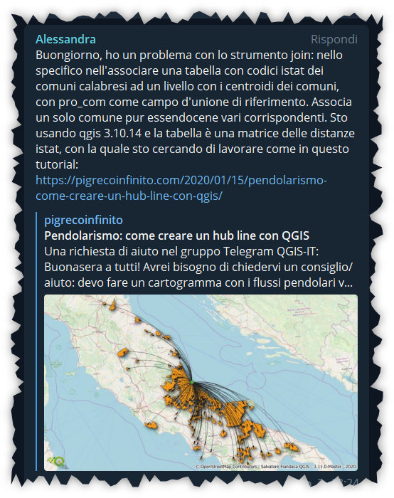

# visidata-gis

Come pulire e filtrare un CSV di 3M di righe per uso GIS

<!-- TOC -->

- [visidata-gis](#visidata-gis)
  - [Come nasce il tutto](#come-nasce-il-tutto)
  - [Link alle risorse](#link-alle-risorse)
  - [Esempi proposti](#esempi-proposti)
  - [Soluzione adottata](#soluzione-adottata)
  - [Relatori](#relatori)
  - [Live su Open Data Sicilia](#live-su-open-data-sicilia)
  - [Programma](#programma)
  - [Risultati Live](#risultati-live)
- [Riferimenti utili](#riferimenti-utili)

<!-- /TOC -->

## Come nasce il tutto

1. Domanda sul [Gruppo Telegram di QGIS Italia](https://t.me/qgis_it)

2. Domanda su Facebook Gruppo [GIS Italia](https://www.facebook.com/groups/GisItalia/posts/10160017122146385/)

↑ [Torna su](#visidata-gis) ↑

## Link alle risorse

- shapefile ISTAT : <https://www.istat.it/storage/cartografia/confini_amministrativi/generalizzati/Limiti01012022_g.zip>
- matrice distanze Calabria : <https://www.istat.it/storage/cartografia/matrici_distanze/Calabria.zip>
- GeoPackage con dati esempio, cartella [risorse](./risorse/prova_chart_atlas.gpkg).

## Esempi proposti

1. File della `matrice delle distanze` della Regione Calabria (Calabria.txt), ha quasi 3.000.000 di righe e risulta poco gestibile sia da QGIS che da altri software (excel, NotePad++): filtrare e pulire i dati → fare una RELAZIONE di Progetto con lo shapefile ISTAT ([QGIS](https://www.qgis.org/it/site/))
2. Tabella degli attributi con molti campi: creare una tabella con solo due campi, tabella Melt → creare atlas con grafico ([QGIS](https://www.qgis.org/it/site/))

## Soluzione adottata

[VisiData](https://www.visidata.org/) è un fantastico strumento open source per esplorare e manipolare dati. Mette insieme la chiarezza di un foglio di calcolo, con l'efficienza del terminale e la potenza di Python, in una utility leggera in grado di gestire milioni di righe con facilità.

## Relatori

- 🧔 [Andrea Borruso](https://twitter.com/aborruso)
- 👨‍🦲 [Totò Fiandaca](https://twitter.com/totofiandaca)

## Live su Open Data Sicilia

- 📅 data: 11 marzo 2022
- 🕞 ore: 17:30 - 18:30
- 📽 piattaforma YouTube canale **Open Data Sicilia** - [ISCRIVITI](https://www.youtube.com/channel/UCyojAonwV6vNNJYAqw4JkTQ)
- 🔗 link diretta : <https://youtu.be/k1AOK3rz8PQ>

↑ [Torna su](#visidata-gis) ↑

## Programma

1. Introduzione a **VisiData** (Andrea Borruso);
2. Esempio d'uso su dati Calabria: pulizia e filtro, per JOIN tabellare (Totò Fiandaca);
3. Esempio di uso su dati forestali: tabella Melt per Atlas (Totò Fiandaca);
4. Domande/risposte (Totò Fiandaca, Andrea Borruso);
5. Chiusura (Andrea Borruso);

## Risultati Live

- numero massimo partecipanti: x
- domande poste

# Riferimenti utili

- **VisiData**: <https://github.com/saulpw/visidata>
- **Guida italiana VisiData**: <https://ondata.github.io/guidaVisiData>
- **ISTAT shapefile**: <https://www.istat.it/it/archivio/222527> 
- **ISTAT matrice distanze**: <https://www.istat.it/it/archivio/157423>
- **QGIS**: <https://www.qgis.org/it/site/>

↑ [Torna su](#visidata-gis) ↑
